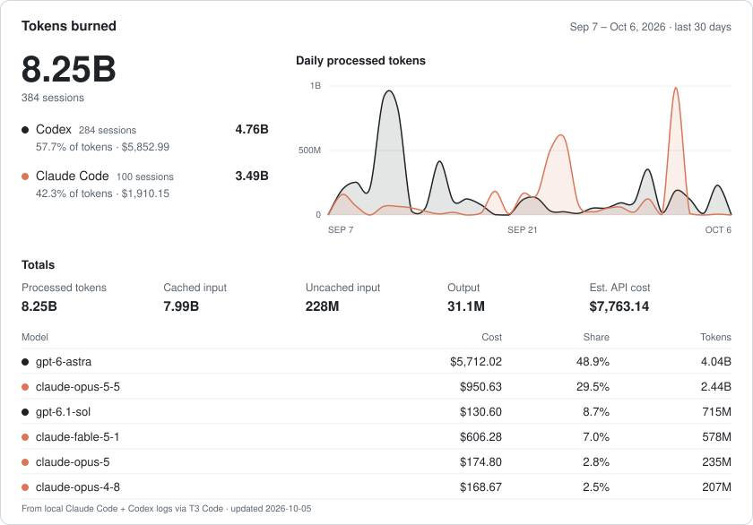

# hi, i'm victor

i build stuff. sometimes it works. [victorivanov.engineer](https://victorivanov.engineer)

## things i made

| project | what it does |
|---|---|
| [linky](https://github.com/LLRHook/linky) | Discord bot for social link previews, tweet/Instagram translation and playable media. Live at [linkybot.dev](https://linkybot.dev) |
| [fix-youtube](https://github.com/LLRHook/fix-youtube) | Browser extension that kills Shorts and recommendations, stops autoplay, and opens Subscriptions by default |
| [citybase](https://github.com/LLRHook/citybase) | Isometric IDE that turns a repo into a hex-tile city and sends coding agents out on Jira quests |
| [mailit](https://github.com/LLRHook/mailit) | Self-hosted email platform: SMTP in and out, DKIM/SPF, bounces, webhooks. Go + Next.js |
| [appshot](https://github.com/LLRHook/appshot) | Local-first App Store screenshot generator with AI headlines. SvelteKit |
| [tcg-order-printer](https://github.com/LLRHook/tcg-order-printer) | Chrome extension: one click prints the TCGplayer packing slip and a 4x6 address label |
| [what-made-em-so-mad](https://github.com/LLRHook/what-made-em-so-mad) | Finds and clips the reaction moments in streamer VODs |
| [youtube-fact-checker](https://github.com/LLRHook/youtube-fact-checker) | Pulls claims out of YouTube transcripts and checks them against the web |
| [applybase](https://github.com/LLRHook/applybase) | LaTeX resumes plus a self-hosted job application tracker |
| [claude-statusline](https://github.com/LLRHook/claude-statusline) | Claude Code status line: model, context, branch, token throughput |
| [usage-widget](https://github.com/LLRHook/usage-widget) | Windows tray monitor for Claude Code and Codex usage |
| [retrocast](https://github.com/LLRHook/retrocast) | Discord-style real-time chat in Go + WebSockets |

## tokens burned

<picture>
  <source media="(prefers-color-scheme: dark)" srcset="assets/usage-dark.svg">
  
</picture>

Refresh: `python scripts/usage_card.py`
